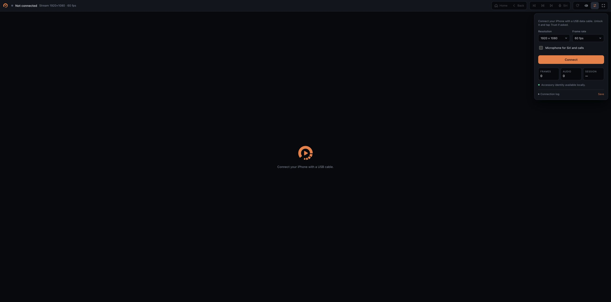

**Use CarPlay from your iPhone in a browser on your Mac.** LoopLink is an experimental macOS CarPlay receiver: connect the iPhone with a USB cable and the CarPlay screen appears in Chrome, with touch, Home/Back, media keys and Siri.



Current browser UI, captured without an iPhone connected.

> **Fork notice.** LoopLink is a fork of [DiPlay](https://github.com/shihabal3amri/DiPlay) by shihabal3amri, which is itself based on [xcertplay](https://github.com/shilapi/xcertplay) by shilapi. The AirPlay, iAP2 and accessory-authentication code comes from those projects. LoopLink removes DiPlay's Android head-unit app and replaces it with a Mac receiver and browser display. It is an independent project and is not affiliated with or endorsed by the DiPlay or xcertplay authors. For the Android receiver, use [DiPlay](https://github.com/shihabal3amri/DiPlay).

## Quick start

```sh
brew install libimobiledevice
scripts/desktop.sh
```

Open **http://127.0.0.1:8765** in Google Chrome, connect your iPhone with a USB data cable, unlock it, tap **Trust** if asked, and click **Connect**.

See [desktop/README.md](desktop/README.md) for how the connection works and what has been validated.

## Accessory identity (required)

The iPhone only starts CarPlay with an authenticated accessory, so LoopLink needs two files that are **not included in this repository**:

```
offline-mfi/certificate.p7b   # accessory certificate the iPhone checks
offline-mfi/identity.pk8      # private key that signs the iPhone's challenge
```

On every connection the iPhone requests the certificate and sends a challenge, which the receiver signs with the key; AirPlay setup uses the same identity. Without these files the receiver refuses to start, and there is no software workaround. The only alternative is a real Apple MFi authentication chip, which this branch does not support.

You must supply your own identity. By default the launcher reads `.private/runtime-assets/offline-mfi/`; to use another folder:

```sh
DIPLAY_AUTH_ASSETS_DIR=/absolute/path/to/runtime-assets scripts/desktop.sh
```

`.private/` is ignored by Git and `scripts/check_public_tree.py` fails if a key or certificate is ever tracked. The key is read only by the local receiver and is never sent to the browser.

## Status

Experimental. Validated on one Mac with an iPhone 17 on iOS 27.0.1 over USB: authentication, live CarPlay video and tap input. Audio, microphone/Siri, other iPhone models and macOS versions are untested. Wireless CarPlay is not supported. This is **not an Apple-certified product**.

## Development

```sh
./gradlew -p desktop test         # protocol and receiver tests
python3 scripts/check_public_tree.py   # fails if credentials are tracked
```

## License

LoopLink is free software under the **GNU General Public License v3.0** — see [LICENSE](LICENSE). As a derivative of DiPlay and xcertplay (both GPL-3.0), it must stay under the same license: you may use, study, modify and share it, but distributed copies and modifications must keep this license and make their source available.

Copyright © 2026 Loopbreak for LoopLink's changes. The original code remains copyright its respective authors. Third-party credits and dependency licenses are in [docs/THIRD_PARTY_NOTICES.md](docs/THIRD_PARTY_NOTICES.md).

CarPlay, iPhone and AirPlay are trademarks of Apple Inc.; no Apple affiliation or endorsement is implied.
