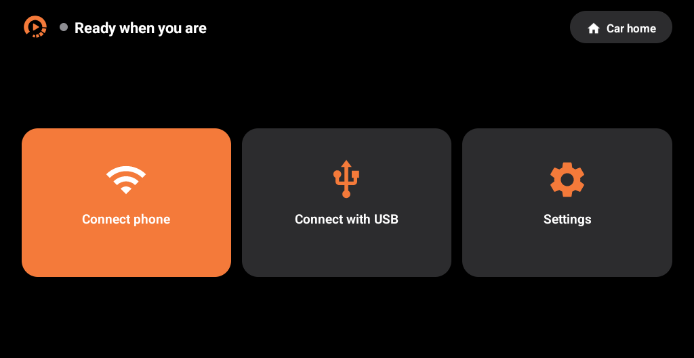

为兼容的比亚迪安卓车机提供有线及无线 CarPlay，采用 DiAuto 风格界面。

> 这些项目专注于比亚迪汽车。它们可能在其他品牌上运行，但其他品牌不在支持范围内，也没有增加支持或修复其品牌特定兼容性问题的计划。

[下载与中文网站](https://shihabal3amri.github.io/DiPlay/zh-Hans/) · [完整说明](README.md) · [报告问题](https://github.com/shihabal3amri/DiPlay/issues/new/choose)

0.2.8 为公开预览版，未经 Apple 认证。请安装在车机上，而非 iPhone。无需越狱、转接盒或认证服务器。无线连接支持车载热点或 Wi-Fi Direct（后者需要 Android 10 或更高版本）。

本版本改进了无线 CarPlay 从蓝牙切换到 Wi-Fi 时以及 USB 连接下的位置上报，更新频率限制为每秒最多一次。可选的 ADB 车轮速度功能会在没有 GPS 时向 iPhone 发送比亚迪车轮速度和挡位，以支持位置推算；隧道效果尚未验证。新增可选的 iOS 27 驻车视频功能，可在车辆处于 P 挡时于车机屏幕播放受支持的视频，并使用 iPhone、触屏和方向盘控制。离开 P 挡后播放器会关闭。Apple TV+ 等受 DRM 保护的视频暂不支持，因为 DiPlay 不是获得 FairPlay 授权的接收器。

认证使用从公开固件中提取的实验性配件身份，无法保证未来持续可用。部分车机仍可能卡顿或无法应用图标大小设置。应用界面支持英语、简体中文、阿拉伯语、俄语和西班牙语。源代码、构建说明及许可证随版本提供。
